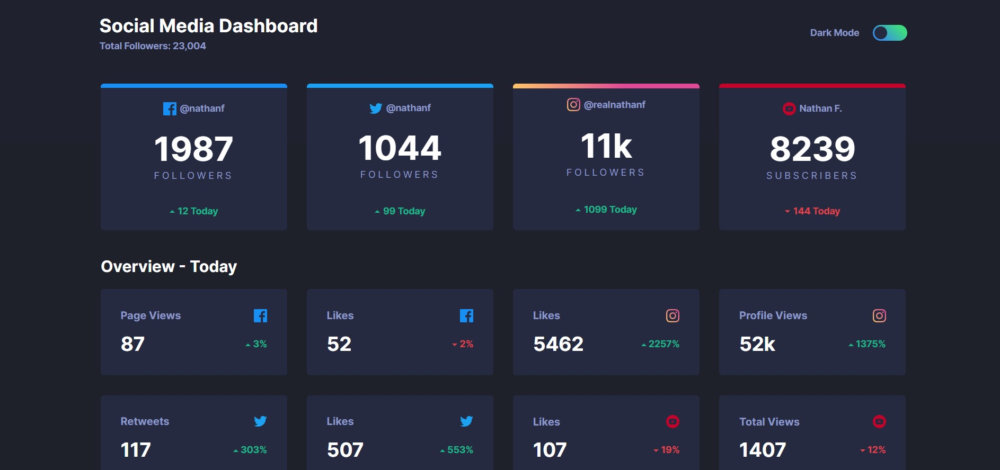

# Frontend Mentor - Social media dashboard with theme switcher solution

This is a solution to the [Social media dashboard with theme switcher challenge on Frontend Mentor](https://www.frontendmentor.io/challenges/social-media-dashboard-with-theme-switcher-6oY8ozp_H). Frontend Mentor challenges help you improve your coding skills by building realistic projects. 

## Table of contents

- [Overview](#overview)
  - [The challenge](#the-challenge)
  - [Screenshot](#screenshot)
- [My process](#my-process)
  - [Built with](#built-with)
  - [What I learned](#what-i-learned)
  - [Continued development](#continued-development)
- [Author](#author)

## Overview

### The challenge

Users should be able to:

- View the optimal layout for the site depending on their device's screen size
- See hover states for all interactive elements on the page
- Toggle color theme to their preference

### Screenshot



## My process

### Built with

- Semantic HTML5 markup
- CSS custom properties
- Flexbox
- CSS Grid
- Mobile-first workflow
- JavaScript

### What I learned

I learned how to change to dark mode on click and how to place the hover effect on the mouse over.  

```js
if(darkBtn.checked) {
  body.classList.add("dark");
  header.classList.add("darkHeader");
  cards[j].classList.add("cardsDark");
  sectionH2.classList.add("darkColor");
  radioBG.classList.add("darkRadioBG");
  toggleBtn.classList.add("darkToogleBtn");
}

toggle.addEventListener("mouseover", () => {
  radioBG.classList.add("hover");
});
```

### Continued development

My solution for dark mode and light mode is very beginner-like. I'll work on using a preferred color scheme to set a dark or light mode.

## Author

- Website - [Djordje Rajc]
- Frontend Mentor - [@Blurryface1998](https://www.frontendmentor.io/profile/Blurryface1998)
- Twitter - [@Blurryface_1998](https://twitter.com/Blurryface_1998)
- Liknedin - [Djordje Rajc] (https://www.linkedin.com/in/djordje-rajc-6925b2194/)